---

# Building a DevOps Pipeline with Jenkins, Aws Ec2, Aws S3 for deploy a website from GitHub Repository

## Problem

In the world of software development, ensuring smooth and efficient collaboration between development and operations teams is crucial. The lack of a streamlined process often leads to delays, errors, and inefficiencies in the deployment and maintenance of applications. DevOps practices aim to address these issues by fostering collaboration and automation throughout the development lifecycle.

## Solution

In this tutorial, we'll create a basic DevOps pipeline using AWS Free Tier services and the open-source tool Jenkins. This pipeline will automate the process of building, testing, and deploying a sample application.

## Pipeline Process

<span>![</span><span></span><span>]</span><span>(</span><span></span><span>)</span>

### Step-by-Step Tutorial:

#### Step 1: Set Up an AWS Account

If you don't have an AWS account, sign up for the AWS Free Tier. This tier provides a range of AWS services at no cost for 12 months.

<span>![</span><span></span><span>]</span><span>(</span><span></span><span>)</span>

#### Step 2: Launch an EC2 Instance for Jenkins

- Navigate to the AWS Management Console and go to the EC2 service.

<span>![</span><span></span><span>]</span><span>(</span><span></span><span>)</span>

- Launch an EC2 instance using the Ubuntu Linux AMI. (You can choose any linux image you feel comfortable with)

<span>![</span><span></span><span>]</span><span>(</span><span>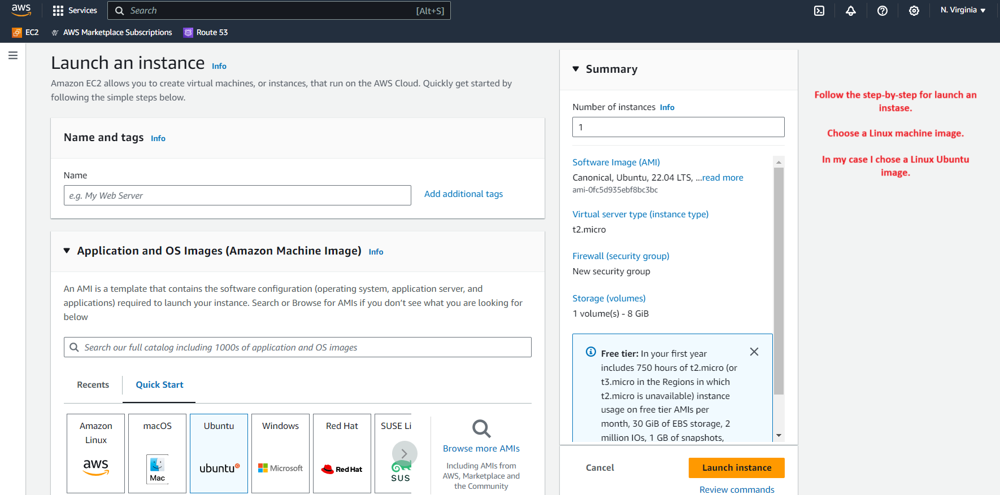</span><span>)</span>

- Configure security groups to allow inbound traffic on port 8080 for Jenkins and enable SSH.

<span>![</span><span></span><span>]</span><span>(</span><span></span><span>)</span>

- Make sure the IAM user has the admin permissions. Otherwise create a group with policy(This policy should permit the ec2 instance perform all actions on s3) and then attach it to the IAM user.

<span>![</span><span></span><span>]</span><span>(</span><span></span><span>)</span>
<span>![</span><span></span><span>]</span><span>(</span><span>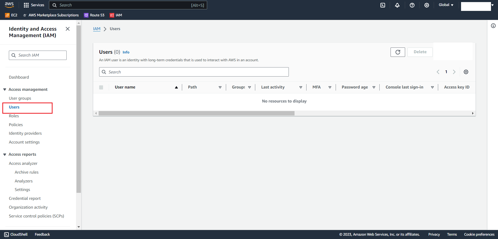</span><span>)</span>
<span>![</span><span></span><span>]</span><span>(</span><span>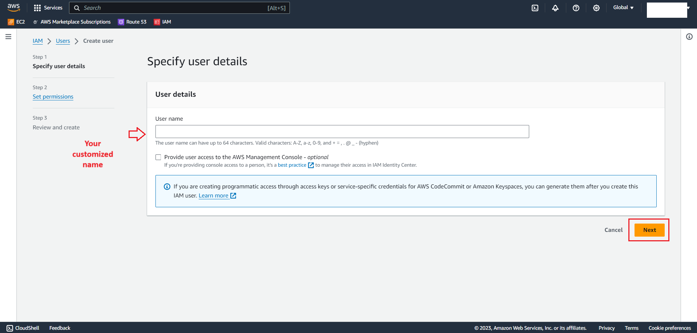</span><span>)</span>
<span>![</span><span></span><span>]</span><span>(</span><span>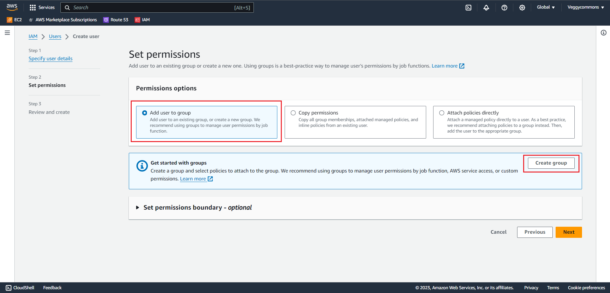</span><span>)</span>
<span>![</span><span></span><span>]</span><span>(</span><span></span><span>)</span>
<span>![</span><span></span><span>]</span><span>(</span><span></span><span>)</span>
<span>![</span><span></span><span>]</span><span>(</span><span>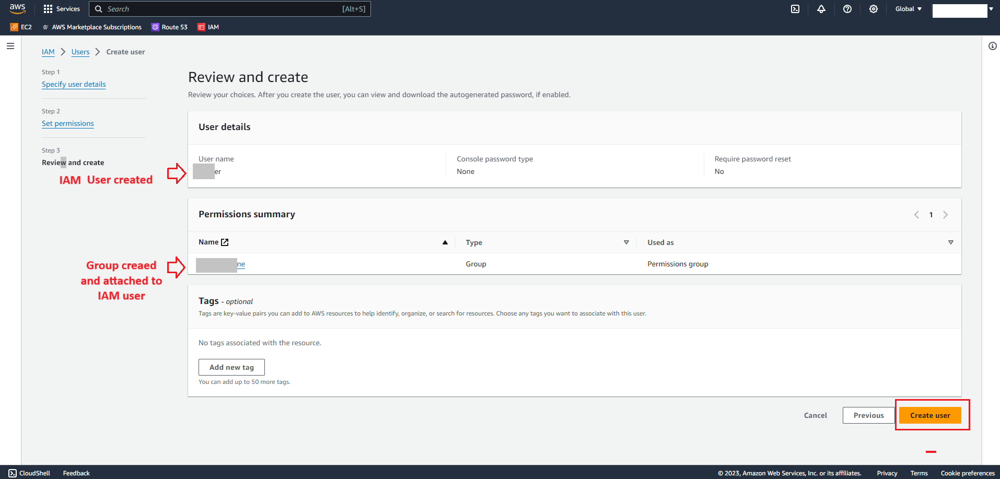</span><span>)</span>

- Once you IAM user is created, go to `IAM > Users > your-user > Create acces key`:

<span>![</span><span></span><span>]</span><span>(</span><span></span><span>)</span>

#### Step 3: Install Jenkins and Git on the EC2 Instance

- Connect to your EC2 instance using SSH.

<span>![</span><span></span><span>]</span><span>(</span><span></span><span>)</span>

- Update the package manager: `sudo apt update`
- Upgrade the package manager: `sudo apt upgrade`
- You need to have Java installed. Check prerequisites for install Jenkins here: https://www.jenkins.io/doc/book/installing/linux/

<span>![</span><span></span><span>]</span><span>(</span><span></span><span>)</span>


- Add the key to your system: `sudo wget -O /usr/share/keyrings/jenkins-keyring.asc \https://pkg.jenkins.io/debian/jenkins.io-2023.key`

- Add a Jenkins apt repository entry: `echo deb [signed-by=/usr/share/keyrings/jenkins-keyring.asc] \https://pkg.jenkins.io/debian binary/ | sudo tee \/etc/apt/sources.list.d/jenkins.list > /dev/null`

- Update your local package index, then install Git: 
  `sudo apt-get update`
  `sudo apt-get install git`

<span>![</span><span></span><span>]</span><span>(</span><span></span><span>)</span>

- Update your local package index, then finally install Jenkins: 
  `sudo apt-get update`
  `sudo apt-get install jenkins`

<span>![</span><span></span><span>]</span><span>(</span><span></span><span>)</span>

- enable the Jenkins service : `sudo systemctl enable jenkins`
- Start the Jenkins service: `sudo systemctl start jenkins`
- Check the status of the Jenkins service `sudo systemctl status jenkins`
- Add and allow port 8080 in ufw firewall: `sudo ufw allow 8080`  

<span>![</span><span></span><span>]</span><span>(</span><span></span><span>)</span>

- Open a web browser and access Jenkins at `http://<your-ec2-instance-public-ip>:8080`
- Retrieve the initial administrator password with root user: `nano /var/lib/jenkins/secrets/initialAdminPassword`

<span>![</span><span></span><span>]</span><span>(</span><span>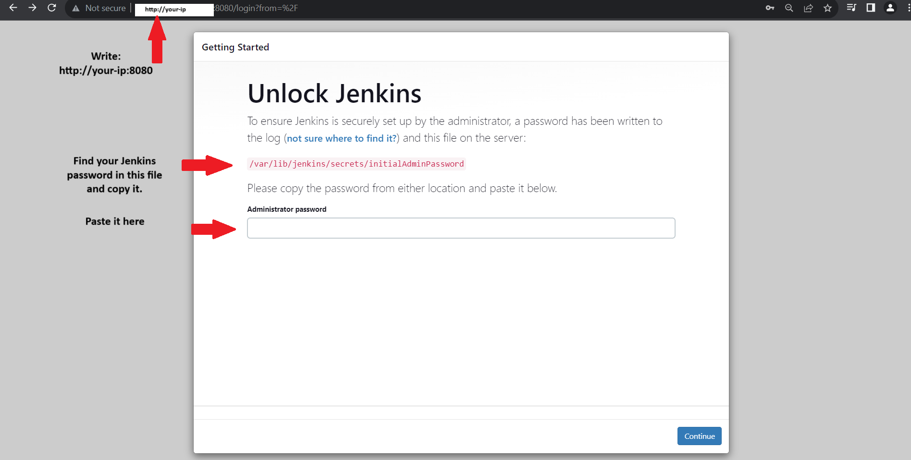</span><span>)</span>

#### Step 4: Configure Jenkins

- Follow the on-screen instructions to set up Jenkins.
- Install plugins via suggested plugins option, we need the AWS Pipeline plugin.
- Create Firts Admin User when filling out the form.

<span>![</span><span></span><span>]</span><span>(</span><span></span><span>)</span>
<span>![</span><span></span><span>]</span><span>(</span><span></span><span>)</span>

#### Step 5: Set Up AWS Credentials in Jenkins

- In Jenkins, go to "Manage Jenkins" > "Manage Credentials" > "System" > "Global credentials (unrestricted) > Add Credentials."

<span>![</span><span></span><span>]</span><span>(</span><span></span><span>)</span>
<span>![</span><span></span><span>]</span><span>(</span><span></span><span>)</span>
<span>![</span><span></span><span>]</span><span>(</span><span></span><span>)</span>
<span>![</span><span></span><span>]</span><span>(</span><span></span><span>)</span>

- Add AWS EC2 credentials with the necessary permissions for your pipeline.

<span>![</span><span></span><span>]</span><span>(</span><span></span><span>)</span>

#### Step 6: Create a Github Repository and Clone it on Your Local Machine

- Create a Github repository called "devops" (or the name you want) wich contains a folder called "jobs"
  and inside this create a file called Dockerfile, a simple static web file (.html) and a jenkinsfile. You can use my Github repository
  and study the code structure inside of each file.

#### Step 7: Setup S3 Bucket

- Configure the Aws s3 bucket, this is where the Jenkins will dump the files from the GitHub. 
  The s3 bucket will be configured for hosting the website.

  If You already know the Aws platform, you can can do it following this tutorial: https://medium.com/nerd-for-tech/how-to-configure-a-static-website-using-a-custom-domain-registered-with-route-53-6f633fb86581

  If you don't know the Aws platform, then you can do it following this documentation:
  https://docs.aws.amazon.com/AmazonS3/latest/userguide/creating-bucket.html

#### Step 8: Configure Jenkins with Aws
Connect the Jenkins with AWS

- Install the following plugins from Jenkins Dashboard:

<span>![</span><span></span><span>]</span><span>(</span><span></span><span>)</span>
<span>![</span><span></span><span>]</span><span>(</span><span></span><span>)</span>
<span>![</span><span></span><span>]</span><span>(</span><span>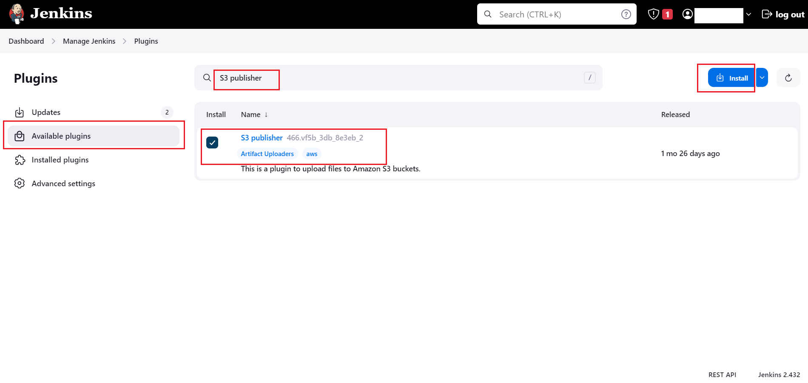</span><span>)</span>

- Add AWS IAM credentials to the jenkins's user as follow:

<span>![</span><span></span><span>]</span><span>(</span><span>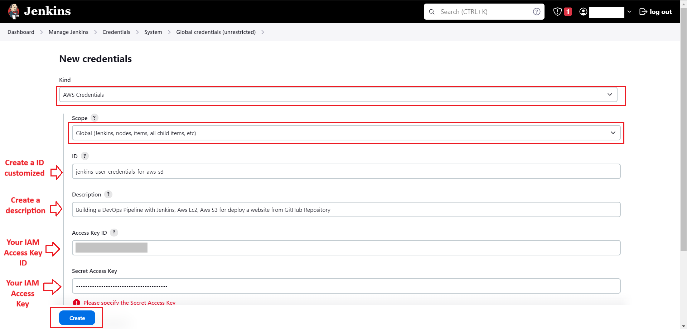</span><span>)</span>

#### Step 9: Create the Pipeline

- Create a pipeline job in Jenkins.

<span>![</span><span></span><span>]</span><span>(</span><span>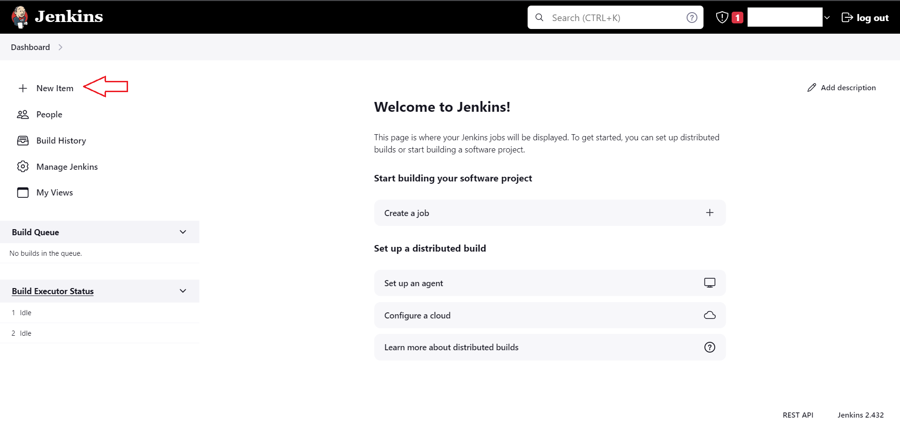</span><span>)</span>
<span>![</span><span></span><span>]</span><span>(</span><span></span><span>)</span>

#### Step 10: Configure Pipeline to Fetch Code from Version Control System (e.g., GitHub)

<span>![</span><span></span><span>]</span><span>(</span><span>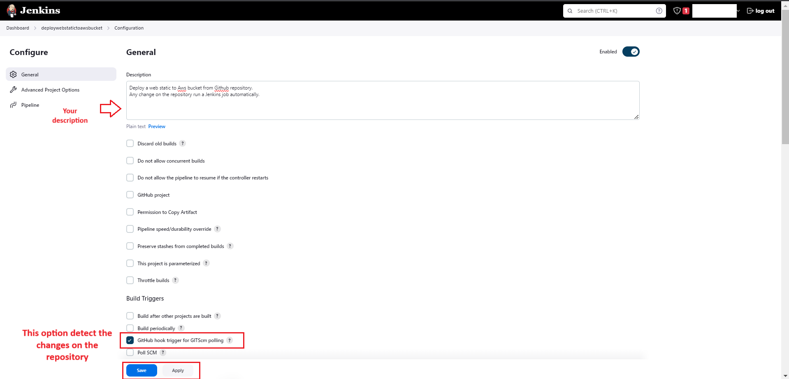</span><span>)</span>

#### Step 11: Define the JenkinsFile File on Your GitHub Repository

- Define stages on jenkinsFile file of your reository for building, testing, and deploying the static web.

```bash

pipeline {
     agent any
     stages {
         stage('Build') {
             steps {
                 sh 'echo "Hello World"'
                 sh '''
                     echo "Multiline shell steps works too"
                     ls -lah
                 '''
             }
         }      
         stage('Upload to AWS') {
              steps {
                  # Write your own Ec2 region, your pipeline ID on credentials
                  withAWS(region:'us-east-1', credentials:'staticwebcredentials') {
                  sh 'echo "Uploading content with AWS credentials"'
                        # Write your index.html of your website and your custom domain registered so that the traffic can be redirected to the s3 bucket
                        s3Upload(pathStyleAccessEnabled: true, payloadSigningEnabled: true, file:'index.html', bucket:'veggycommons.com')
                        s3Upload(pathStyleAccessEnabled: true, payloadSigningEnabled: true, file:'404.html', bucket:'veggycommons.com')
                        s3Upload(pathStyleAccessEnabled: true, payloadSigningEnabled: true, file:'css', bucket:'veggycommons.com')
                        s3Upload(pathStyleAccessEnabled: true, payloadSigningEnabled: true, file:'js', bucket:'veggycommons.com')
                        s3Upload(pathStyleAccessEnabled: true, payloadSigningEnabled: true, file:'assets', bucket:'veggycommons.com')
                     
                  }
              }
         }
     }
}


```

<span>![</span><span></span><span>]</span><span>(</span><span></span><span>)</span>

#### Step 12: Trigger the Pipeline

- Manually trigger the pipeline to observe the stages in action.

<span>![</span><span></span><span>]</span><span>(</span><span></span><span>)</span>

- Verify the deployment of website files on your Aws S3 bucket.

<span>![</span><span></span><span>]</span><span>(</span><span></span><span>)</span>

- Verify the deployment of your website your domain (In my case vwggycommon.com).

<span>![</span><span></span><span>]</span><span>(</span><span>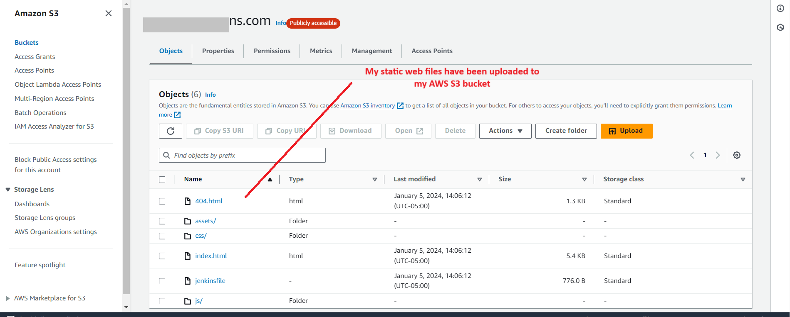</span><span>)</span>


Congratulations! You've successfully set up a basic DevOps pipeline using AWS and Jenkins. 
Whenever I update my code, I'll initiate the build process in Jenkins to deploy the changes. This action can also be automated, triggering the deployment whenever new code is pushed or changes are made.

This pipeline can serve as a foundation for expanding your DevOps practices, incorporating additional tools, and automating more aspects of your development lifecycle.

---